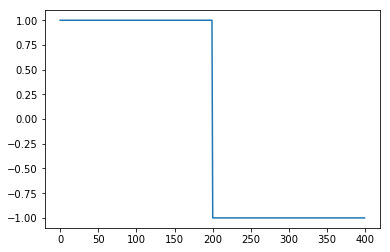
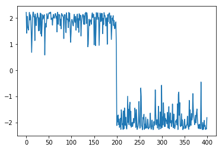
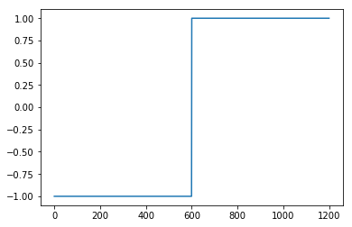
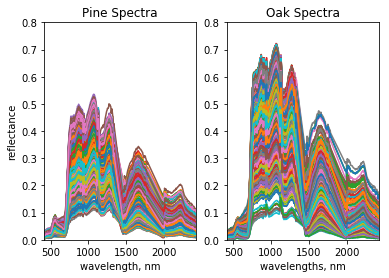
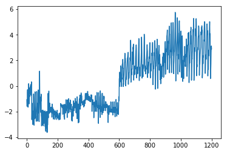
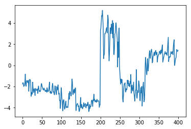

## Support Vector Machines

This tutorial shows an example of SVM Classification using python's scikit-learn module. 

First import required packages:


```python
import numpy as np
import matplotlib
import matplotlib.pyplot as plt
from scipy import linalg
from scipy import io
```


```python
from sklearn import linear_model as lmd
```

Load Data:


```python
InFile1          = '../data/PaulGader/LinSepC1.mat'
InFile2          = '../data/PaulGader/LinSepC2.mat'
C1Dict           = io.loadmat(InFile1)
C2Dict           = io.loadmat(InFile2)
C1               = C1Dict['LinSepC1']
C2               = C2Dict['LinSepC2']
NSampsClass    = 200
NSamps         = 2*NSampsClass
```


```python
### Set Target Outputs ###
#1st 200 are +1 , 2nd 200 are -1
TargetOutputs                     =  np.ones((NSamps,1))
TargetOutputs[NSampsClass:NSamps] = -TargetOutputs[NSampsClass:NSamps]
AllSamps     = np.concatenate((C1,C2),axis=0)
AllSamps.shape
```


    (400, 2)


```python
# Make an instance of this object
M = lmd.LinearRegression()
print(M) #M is a LinearRegression class
LinMod = M.fit(AllSamps, TargetOutputs,sample_weight=None)
print(LinMod)
```

    LinearRegression(copy_X=True, fit_intercept=True, n_jobs=1, normalize=False)
    LinearRegression(copy_X=True, fit_intercept=True, n_jobs=1, normalize=False)
    


```python
# LinMod = lmd.LinearRegression.fit(M, AllSamps, TargetOutputs, sample_weight=None)

# pass by reference: saves memory; pointer to data
# pass by value: makes a copy and passes in
# need to include M as an input -- 1st argument is "self" 
# defines class that it is fitting -> this is a linear regression
```


```python
# Score - give R^2 value
R = lmd.LinearRegression.score(LinMod, AllSamps, TargetOutputs, sample_weight=None)
print(R)
```

    0.911269176982
    


```python
LinMod
```


    LinearRegression(copy_X=True, fit_intercept=True, n_jobs=1, normalize=False)


```python
w = LinMod.coef_
print('coefficients:',w)
```

    coefficients: [[ 0.81592447  0.94178188]]
    


```python
w0 = LinMod.intercept_
print('intercept:',w0)
```

    intercept: [-0.01663028]
    

### Question:  How would we compute the outputs of the regression model?

Learn About Kernels

Do some SVM Classification


```python
from sklearn.svm import SVC
```


```python
### SVC wants a 1d array, not a column vector
Targets = np.ravel(TargetOutputs)  #flatten using np.ravel
```


```python
InitSVM = SVC() #initialize SVM
InitSVM
```


    SVC(C=1.0, cache_size=200, class_weight=None, coef0=0.0,
      decision_function_shape=None, degree=3, gamma='auto', kernel='rbf',
      max_iter=-1, probability=False, random_state=None, shrinking=True,
      tol=0.001, verbose=False)


C is the slack variable. Since we are minimizing the funciton ..., if C is large, zeta must be small --> less slack. 


```python
#Train
TrainedSVM = InitSVM.fit(AllSamps, Targets)
```


```python
#Predict
y = TrainedSVM.predict(AllSamps)
```


```python
#Plot linearly seperable practice data. SVM solves it well. 
plt.figure(1)
plt.plot(y)
plt.show()
```





```python
#make a decision function
d = TrainedSVM.decision_function(AllSamps)
```


```python

plt.figure(1)
plt.plot(d)
plt.show()
```





Can try it with Outliers if we have time

Let's look at some spectra from real data collected at OSBS:


```python
### Look at some Pine and Oak spectra from
### NEON Site D03 Ordway-Swisher Biological Station
### at UF
### Pinus palustris
### Quercus virginiana
InFile1 = '../data/PaulGader/Pines.mat'
InFile2 = '../data/PaulGader/Oaks.mat'
C1Dict  = io.loadmat(InFile1)
C2Dict  = io.loadmat(InFile2)
Pines   = C1Dict['Pines']
Oaks    = C2Dict['Oaks']
```


```python
WvFile  = '../data/PaulGader/NEONWvsNBB.mat'
WvDict  = io.loadmat(WvFile)
Wv      = WvDict['NEONWvsNBB']
```


```python
print('shape of pines data:',Pines.shape)
print('shape of oaks data:',Oaks.shape)
```

    shape of pines data: (809, 346)
    shape of oaks data: (1731, 346)
    


```python
NBands=Wv.shape[0]
print('number of bands:',NBands)
```

    number of bands: 346
    

Notice that these training sets are unbalanced


```python
# Take a subset of 600 samples for training and 200 for testing
NTrainSampsClass = 600
NTestSampsClass  = 200
Targets          = np.ones((1200,1))
Targets[range(600)] = -Targets[range(600)]
Targets             = np.ravel(Targets)
print(Targets.shape)
```

    (1200,)
    


```python
plt.figure(11)
plt.plot(Targets)
plt.show()
```





```python
TrainPines = Pines[0:600,:]
TrainOaks  = Oaks[0:600,:]
#TrainSet   = np.concatenate?
```


```python
#concatenate training data
TrainSet   = np.concatenate((TrainPines, TrainOaks), axis=0)
print(TrainSet.shape)
```

    (1200, 346)
    

1200 training patterns each with 346 dimensions


```python
plt.figure(3)
### Plot Pine Training Spectra ###
plt.subplot(121)
plt.plot(Wv, TrainPines.T); plt.title('Pine Spectra')
plt.xlabel('wavelength, nm'); plt.ylabel('reflectance')
plt.ylim((0.0,0.8))
plt.xlim((Wv[1], Wv[NBands-1]))
### Plot Oak Training Spectra ###
plt.subplot(122)
plt.plot(Wv, TrainOaks.T); plt.title('Oak Spectra')
plt.ylim((0.0,0.8))
plt.xlim((Wv[1], Wv[NBands-1]))
plt.xlabel('wavelengths, nm')
plt.show()
```





There is overlap between the spectral signatures of these two training sets. This could be due to precense of shadows, understory, etc.


```python
# Look at Support Vector Classification function
SVC?
# C: Penalty parameter C of the error term
```


```python
# Initialize, 
# InitSVM= SVC() #run with default C to start, then change
# C is a ...
InitSVM= SVC(C=500) #SVC: S Vector Classifiers, change C for lazy fix
TrainedSVM=InitSVM.fit(TrainSet, Targets)
d = TrainedSVM.decision_function(TrainSet) 
#decision function gives probabalistic values
```


```python
# Plot
plt.figure(4)
plt.plot(d)
plt.show()
```





Plot looks not that great. Seems to be doing slightly better on class 1.  Class 2 is all over the place. There are a few things you can do:
1. look at errors
2. be lazy and change value of C to 500. 

Does this seem to be too good to be true?

Could be that there are pixels in the training data that are not leaves or pine needles and there may be a lot of mixed pixels (eg. branches, leaves, understory, ground ...). Best to draw polygons around known objects and only use pixels within the polygons for classification. Or use NDVI thresholds, extract spectra from the limbs, or tree structure (eg. LiDAR data can give useful info about the tree type). 


```python
TestPines = Pines[600:800,:]
TestOaks  = Oaks[600:800,:]
```


```python
TestSet = np.concatenate((TestPines, TestOaks), axis=0)
print('Test Set Shape:',TestSet.shape)
dtest = TrainedSVM.decision_function(TestSet)
```

    Test Set Shape: (400, 346)
    


```python
plt.figure(5)
plt.plot(dtest)
plt.show()
```





Yeah, too good to be true...What can we do?

Error Analysis: identify characteristics of errors, try different magic numbers using cross validation, etc.

### Links and References:

Scikit-Learn: http://scikit-learn.org/stable/

Bishop, Christopher M. 2006. Pattern Recognition and Machine Learning (Information Science and Statistics). Springer-Verlag New York, Inc.
